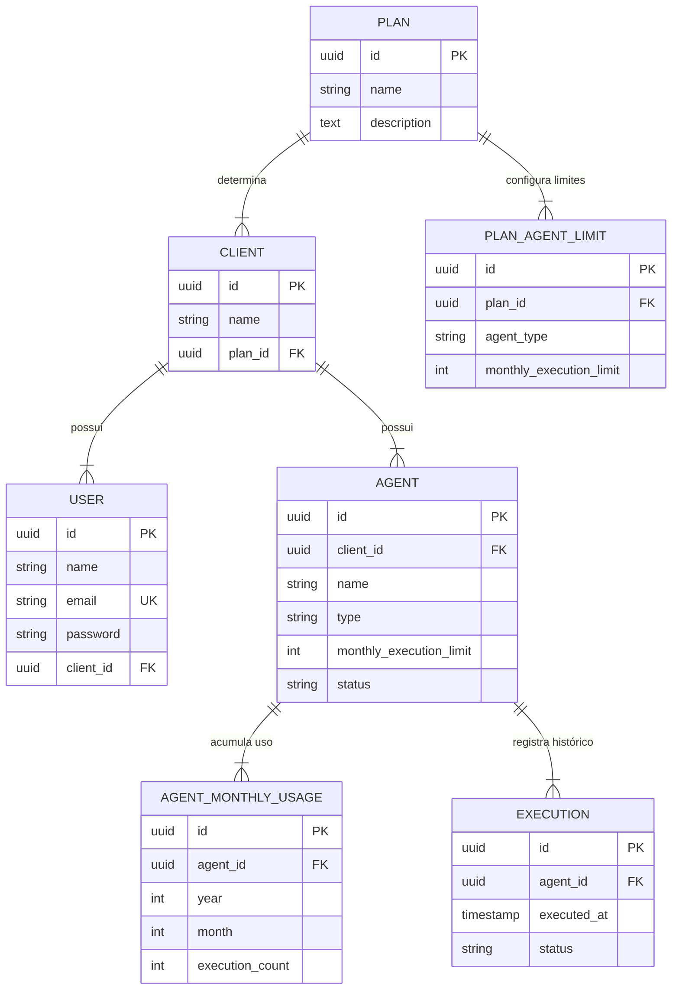

# AI Agent Monitoring Dashboard — Rotik Fullstack Challenge

## 1. Contexto

Este projeto é um dashboard para monitoramento de agentes de inteligência artificial (AI Agents). A aplicação permite que usuários autenticados visualizem os agentes pertencentes à sua empresa (Client), acompanhem o consumo mensal de execuções contra o limite contratado, cadastrem novos agentes com limites herdados automaticamente do plano e acompanhem o histórico paginado de execuções.

A estrutura do repositório é organizada separando o **Backend** (`/backend`) e o **Frontend** (`/frontend`) em pastas dedicadas na raiz do projeto.

---

## 2. Discovery

Durante a análise técnica inicial, foram identificados os principais desafios do produto:
* **Garantia de limite estrito sob concorrência**: Múltiplas requisições simultâneas de execução para o mesmo agente não podem ultrapassar a quota mensal.
* **Isolamento multitenant (Client Isolation)**: Usuários de um cliente jamais podem visualizar ou executar agentes de outro cliente. Tentativas de acesso não autorizado devem retornar HTTP 404 (RESOURCE_NOT_FOUND) para evitar varredura ou divulgação da existência de recursos de terceiros.
* **Rollover automático de mês**: Viradas de mês devem iniciar automaticamente com quota limpa (0 execuções), permitindo que agentes bloqueados no mês anterior voltem a funcionar normalmente sem necessidade de rotinas cron de reset.

---

## 3. Perguntas e Assumptions (Discovery)

Na ausência de esclarecimentos adicionais, foram estabelecidas 7 premissas fundamentais para o desenvolvimento do MVP:

1. **Pergunta 1 (Escopo do limite)**: *O limite do plano aplica-se por cliente ou por agente individual?*
   * **Assumption**: O plano define o teto mensal por tipo de agente para a empresa contratante. Esse teto é herdado pelo registro do agente (`Agent.monthly_execution_limit`) no momento do seu cadastro.

2. **Pergunta 2 (Limites por tipo de agente)**: *Todos os tipos de agente compartilham o mesmo limite ou variam por categoria?*
   * **Assumption**: Cada plano especifica limites distintos para categorias como `SUPPORT`, `SALES` e `GENERAL` através da entidade `PlanAgentLimit`.

3. **Pergunta 3 (Comportamento de execuções FAILED)**: *Execuções com falha consomem a quota mensal do plano?*
   * **Assumption**: Somente execuções com status `SUCCESS` consomem a quota mensal. Execuções `FAILED` são salvas na tabela `executions` para fins de auditoria e diagnóstico do CS, mas **não** incrementam o consumo em `agent_monthly_usages`.

4. **Pergunta 4 (Comportamento ao atingir o limite)**: *Qual deve ser a resposta do sistema quando o limite é atingido?*
   * **Assumption**: Novas tentativas de execução no endpoint `POST /api/agents/{agent}/executions` retornam `HTTP 429` (`EXECUTION_LIMIT_REACHED`), registram aviso em log (`Log::warning`) e sinalizam o status operacional do agente como `BLOCKED`.

5. **Pergunta 5 (Alteração do plano/limite pós-criação)**: *O que acontece se o limite do plano for alterado após a criação do agente?*
   * **Assumption**: No MVP, o limite gravado no `Agent` torna-se estável para aquele agente. Ajustes futuros no plano aplicam-se a novos agentes cadastrados ou via atualização manual explícita.

6. **Pergunta 6 (Isolamento entre clientes)**: *Como responder a tentativas de acesso a agentes de outros clientes?*
   * **Assumption**: Qualquer tentativa de acessar ou executar um agente pertencente a outro cliente retorna `HTTP 404` (`RESOURCE_NOT_FOUND`) em vez de `HTTP 403`, garantindo isolamento multitenant total sem vazamento de metadados.

7. **Pergunta 7 (Exclusão de agentes)**: *A funcionalidade de exclusão de agentes deve estar presente no MVP?*
   * **Assumption**: A exclusão de agentes foi deixada fora do escopo do MVP. Tecnicamente, a abordagem ideal seria o uso de **Soft Delete (`deleted_at`)** para preservar a integridade referencial das tabelas `executions` e `agent_monthly_usages`. No entanto, no MVP optou-se por focar estritamente na criação e no monitoramento de consumo, evitando também regras complexas de produto como o reuso de quota por recriação de agentes no mesmo mês.

---

### 3.1. Riscos e Ambiguidades Não Resolvidas no MVP

1. **Latência e Crescimento Contínuo da Tabela de Execuções (`executions`)**:
   * *Risco*: À medida que milhões de execuções forem gravadas, a tabela `executions` pode crescer rapidamente.
   * *Decisão*: Para o MVP, o controle de quota é isolado na tabela leve `agent_monthly_usages`. Decidimos não aplicar particionamento de banco ou expurgo de histórico no MVP para manter o escopo enxuto, sendo uma melhoria razoável para a fase pós-lançamento.
2. **Estabilidade de Limites em Agentes Existentes vs. Mudança de Plano**:
   * *Risco*: Se um cliente alterar seu plano contratado, agentes criados anteriormente mantêm o limite original salvo na criação.
   * *Decisão*: Manter o limite imutável no modelo do `Agent` previne distorções retroativas nos relatórios de consumo do CS. Atualizações de limite sob demanda podem ser tratadas em uma funcionalidade administrativa futura.
3. **Fuso Horário na Virada de Mês**:
   * *Risco*: Viradas de mês podem ocorrer em horários diferentes dependendo da região do cliente.
   * *Decisão*: O MVP utiliza o horário padronizado em `UTC` para todas as agregações de ano/mês (`now()->year`, `now()->month`), garantindo coerência transacional global no banco de dados.

---

## 4. Entidades

1. **Plan**: Define o plano contratado (ex: PRO).
2. **Client**: Empresa contratante pertencente a um Plan.
3. **User**: Usuário autenticado pertencente a um Client.
4. **PlanAgentLimit**: Define o limite mensal por tipo de agente (`SUPPORT`, `SALES`, `GENERAL`) para um plano.
5. **Agent**: Agente de IA pertencente a um Client, com tipo, limite e status (`ACTIVE` / `BLOCKED`).
6. **AgentMonthlyUsage**: Tabela agregada por `agent_id + year + month` que mantém o contador de execuções com sucesso.
7. **Execution**: Histórico granular de cada execução com carimbo de data/hora (`executed_at`) e status (`SUCCESS` / `FAILED`).

---

## 5. Escopo do MVP

* Autenticação via Laravel Sanctum (`POST /api/auth/login`).
* Listagem de agentes com consumo mensal atual e percentual visual (`GET /api/agents`).
* Consulta de tipos de agente disponíveis no plano do cliente (`GET /api/agents/available-types`).
* Cadastro de novos agentes (`POST /api/agents`).
* Execução concorrencial segura de agentes (`POST /api/agents/{agent}/executions`).
* Detalhes do agente e histórico paginado (`GET /api/agents/{agent}/executions`).
* Interface React + TypeScript responsiva (Mobile e Desktop) com feedback visual de loading, erros, empty state e retry.
* Acessibilidade básica (labels explícitos, contraste HSL/Slate, navegação por teclado e HTML5 semântico).
* Otimização de performance no frontend (paginação server-side, retenção de estado global restrito e memoização).

---

## 6. Fora do Escopo

* OAuth / Social Login completo.
* Gestão complexa de permissões (RBAC).
* Módulos de cobrança/billing.
* Event Sourcing, CQRS, WebSockets ou brokers de mensagem (Kafka/RabbitMQ).
* CRUD administrativo de planos/clientes.
* Exclusão de agentes no MVP.

---

## 7. Estrutura do Repositório

```
rotik-challenge/
├── backend/                  # Aplicação Laravel (PHP 8.4)
│   ├── app/
│   ├── database/
│   ├── routes/
│   ├── tests/
│   ├── Dockerfile
│   └── composer.json
├── frontend/                 # Aplicação React + Vite (TypeScript)
│   ├── src/
│   ├── public/
│   ├── Dockerfile
│   └── package.json
├── docker-compose.yml        # Orquestrador dos containers
└── README.md
```

---

## 8. Decisões de Arquitetura

* **Controllers Finos**: Apenas orquestram a validação via Form Requests, chamam os Services e formatam a resposta via API Resources.
* **Services**: Encapsulam toda a regra de negócio e controle de transações (`AgentService`, `ExecutionService`).
* **Policies**: Encapsulam a lógica de autorização por cliente (`AgentPolicy`).
* **Respostas Consistentes de Erro**: Formato unificado contendo `{ "error": { "code": "CÓDIGO", "message": "Mensagem" } }` para códigos 400, 401, 403, 404, 422, 429 e 500.

### 8.1. Endpoints da API
* `POST /api/auth/login`: Autenticação do usuário e emissão do Bearer Token Sanctum.
* `GET /api/agents`: Lista os agentes da empresa do usuário logado, incluindo contagem de execuções do mês atual e percentual de uso da quota.
* `GET /api/agents/available-types`: Retorna os tipos de agentes suportados pelo plano da empresa e seus respectivos limites mensais, permitindo ao frontend exibir contexto claro no formulário de criação.
* `POST /api/agents`: Cadastra um novo agente atribuindo automaticamente o limite mensal configurado no plano da empresa.
* `POST /api/agents/{agent}/executions`: Registra a execução de um agente com verificação concorrencial da quota (`SELECT FOR UPDATE`).
* `GET /api/agents/{agent}/executions`: Traz o histórico paginado de execuções de um agente específico.

---

## 9. Stack e Justificativa

* **PHP 8.4 + Laravel 13**: Framework maduro, excelente ORM (Eloquent), suporte nativo a UUIDs e ecossistema robusto para APIs RESTful.
* **Laravel Sanctum**: Solução leve e segura para emissão de API Tokens Bearer.
* **PostgreSQL 16**: Banco de dados relacional forte em ACID, suporte nativo a UUIDs e travamento pessimista seguro (`SELECT ... FOR UPDATE`).
* **React + Vite + TypeScript**: Interface moderna, rápida, fortemente tipada e com hot reload instantâneo.
* **Zustand**: Gerenciamento de estado global mínimo e performático **exclusivamente** para a sessão/token de autenticação.
* **TailwindCSS v4**: Estilização moderna com utilitários CSS de alta fidelidade, responsividade fluida e acessibilidade visual.

### 9.1. Frontend: Responsividade (Mobile & Desktop)
A interface foi construída seguindo uma abordagem **Mobile-First** com o TailwindCSS v4:
* Layouts em Grid dinâmico que transitam suavemente de 1 coluna em telas móbile (`grid-cols-1`) para 2 ou 3 colunas em tablets e desktops (`md:grid-cols-2 lg:grid-cols-3`).
* Barra de navegação responsiva com colapso de elementos em telas estreitas e troca rápida de idioma (🇧🇷 PT / 🇺🇸 EN).
* Modais de formulário adaptáveis à altura da viewport com scroll interno seguro.

### 9.2. Frontend: Acessibilidade Básica (A11y)
* **HTML5 Semântico**: Estrutura organizada com `<header>`, `<main>`, `<section>`, `<article>`, `<table>`, `<thead>` e `<tbody>`.
* **Associação Explícita de Labels**: Todos os campos do formulário de login e cadastro possuem vinculação id-label (`<label htmlFor="...">`).
* **Contraste de Cores Elevado**: Cores utilitárias HSL/Slate garantem legibilidade (ex: texto `text-slate-900` em fundo claro; badges com fundo suave e texto escuro de alto contraste).
* **Navegação por Teclado**: Modais possuem suporte a fechamento via tecla `Esc` e elementos clicáveis exibem anéis de foco destacados (`focus:ring-2`).

### 9.3. Frontend: Performance e Otimizações
* **Gerenciamento de Estado Granular (Zustand)**: O estado global Zustand é restrito unicamente às credenciais de autenticação (`useAuthStore`). Estados de página e formulários são mantidos localmente, evitando *re-renders* em cascata na árvore de componentes.
* **Paginação de Dados no Servidor**: O histórico de execuções é paginado via API (`GET /api/agents/{agent}/executions?page=N`), evitando sobrecarregar a DOM com milhares de nós HTML.
* **Memoização de Referências**: Callbacks e carregadores de dados são protegidos com `useCallback` para manter estabilidade de referências entre re-renderizações.

---

## 10. Diagrama de Entidade-Relacionamento (ERD)



---

## 11. Regras de Quota e Agregação Mensal

### Por que agregar em `agent_monthly_usage` em vez de contar `executions` a cada requisição?

1. **Projeção Mensal Performática**: Preferimos uma projeção mensal porque o consumo é um dado operacional consultado frequentemente no dashboard e atualizado a cada execução bem-sucedida. O agregado evita recalcular o consumo a partir do histórico a cada leitura e oferece uma linha naturalmente adequada para controle transacional da quota.
2. **Atomicidade e Concorrência**: Com a tabela agregada `agent_monthly_usages`, a operação de consumo é reduzida a um `UPDATE agent_monthly_usages SET execution_count = execution_count + 1 WHERE agent_id = ? AND year = ? AND month = ?` protegido por um lock de linha (`lockForUpdate()`), garantindo altíssimo throughput e zero condição de corrida.
3. **Rollover de Mês sem Cron**: Como a chave primária de uso é `(agent_id, year, month)`, o novo período mensal começa com consumo zero. O agente volta a ser operacionalmente elegível porque a quota do novo período não foi atingida, sem necessidade de processos batch ou cron jobs de reset.

---

## 12. Instruções Locais

### Backend (Laravel)
```bash
# 1. Entrar na pasta do backend
cd backend

# 2. Copiar variáveis de ambiente
cp .env.example .env

# 3. Instalar dependências
composer install

# 4. Gerar chave da aplicação
php artisan key:generate

# 5. Executar migrações e seed de demonstração
php artisan migrate:fresh --seed

# 6. Iniciar servidor de desenvolvimento
php artisan serve
```

### Frontend (React)
```bash
# 1. Entrar na pasta do frontend
cd frontend

# 2. Instalar dependências
npm install

# 3. Iniciar servidor Vite (porta 3000 com proxy para localhost:8000)
npm run dev
```

Credenciais de Demonstração:
* **Email**: `demo@rotik.com`
* **Senha**: `password`

---

## 13. Docker

A aplicação é totalmente dockerizada através do Docker Compose:

```bash
# Subir os containers de Banco de Dados (PostgreSQL 16), Backend (Laravel) e Frontend (Nginx)
docker compose up -d --build
```

Endereços disponíveis:
* **Frontend**: `http://localhost:3000`
* **Backend API**: `http://localhost:8000/api`
* **PostgreSQL**: `localhost:5432`

---

## 14. Testes e Qualidade de Código

```bash
# Executar suíte de testes backend (PHPUnit)
cd backend && php artisan test

# Executar linter de padronização backend (Laravel Pint)
cd backend && ./vendor/bin/pint --test

# Executar linter de alta velocidade do frontend (Oxlint)
cd frontend && npm run lint

# Executar verificação de tipos e build de produção do frontend
cd frontend && npm run build
```

---

## 15. Integração Contínua (CI)

O workflow do **GitHub Actions** em `.github/workflows/ci.yml` valida:
* **Backend**: Instalação de dependências em `backend/`, verificação de estilo com Laravel Pint e suíte de 18 testes automatizados contra banco PostgreSQL.
* **Frontend**: Instalação em `frontend/`, análise estática com Oxlint (`npm run lint`), checagem de tipos TypeScript (`tsc -b`) e build de produção Vite (`npm run build`).

---

## 16. Deploy

* **Frontend**: Deploy na Vercel a partir da pasta `frontend/`.
* **Backend**: Deploy no Render a partir da pasta `backend/`.
* **Banco de Dados**: PostgreSQL gerenciado (Neon Postgres / Render Postgres).

URL de Demonstração Pública:
* *As URLs de produção serão adicionadas após a publicação final dos serviços.*

---

## 17. Debugging (Resolução de Problemas Durante o Desenvolvimento)

### Problema 1: `VerbatimModuleSyntax` na compilação TypeScript do Frontend
* **Sintoma**: Falha no comando `npm run build` com os erros `TS1484: 'Agent' is a type and must be imported using a type-only import`.
* **Causa**: O template Vite TypeScript ativou a flag `verbatimModuleSyntax` no `tsconfig.app.json`, exigindo importações explícitas de tipo.
* **Solução**: Atualização de todos os arquivos do frontend para usar a sintaxe `import type { ... }` para interfaces e tipos.
* **Validação**: Execução com sucesso do comando `npm run build`.

### Problema 2: Status HTTP 201 vs 200 na Criação de Execução
* **Sintoma**: Falha nos testes da API de execução esperando código HTTP 200, enquanto a resposta retornava HTTP 201.
* **Causa**: Os recursos `JsonResource` do Laravel retornam automaticamente HTTP 201 Created quando acionados via método `POST`.
* **Solução**: Ajuste dos testes para validar o código RESTful correto (HTTP 201 Created).
* **Validação**: Todos os 18 testes passando com sucesso.

---

---

## 18. Etapa 7 — Mentalidade de Produto

### 1. Essa funcionalidade gera valor real para a Rotik? Para quem exatamente?
**Sim, gera valor altíssimo e imediato para três públicos principais:**
* **Time de CS / Suporte**: Elimina o diagnóstico manual via planilhas/logs brutos. O CS identifica em segundos por que um agente parou de responder (estouro de quota vs erro técnico).
* **Time Comercial / Vendas**: Habilita a detecção proativa de contas prontas para upgrade. Agentes atingindo 80–100% da quota representam oportunidades de expansão de receita (*upsell*) antes que o cliente sinta insatisfação.
* **Cliente Final**: Recebe clareza e transparência sobre o consumo do seu plano, evitando interrupções inesperadas de serviço.

---

### 2. Existiria uma solução mais simples que ainda resolveria o problema central?
**Sim.** Uma alternativa *No-Code / Low-Cost* inicial seria:
* **Automação via Cron Job + Webhook no Slack/Email**: Um script diário rodando uma consulta SQL agregada no banco atual que enviasse um alerta no canal do Slack do CS (`#cs-alerts-quota`) sempre que uma conta ultrapassasse 85% do limite.
* **Por que desenvolvemos o Dashboard?**: Embora o alerta simples no Slack informasse o estouro, ele não oferecia a funcionalidade crítica de cadastramento autônomo de agentes, visualização de histórico de execuções com causa de falha, nem a aplicação estrita de bloqueio em tempo real (`SELECT FOR UPDATE`).

---

### 3. Vale a pena a Rotik investir nisso agora, ou há algo mais prioritário?
**Vale a pena investir no MVP de Monitoramento agora.**
* **Justificativa**: O custo operacional de diagnosticar falhas manualmente e o risco de churn por agentes que param de responder sem aviso superam o custo de engenharia deste MVP.
* **Foco no Essencial**: Como o MVP foi modelado com escopo enxuto (foco no consumo e bloqueio sem over-engineering), o investimento é baixo e estanca a perda de tempo do time interno imediatamente.

---

### 4. Como medir se essa funcionalidade está dando certo após o lançamento? (Métricas Concretas)
1. **Redução no Time-to-Diagnose (MTTR) do CS**: Queda de 80%+ no tempo médio para suporte responder por que um agente parou de responder (meta: < 2 minutos).
2. **Taxa de Conversão de Upsell Proativo**: % de clientes alertados na faixa amarela (80-100% de uso) que realizaram upgrade de plano em até 14 dias.
3. **Quota Compliance Rate (% de Execuções Bloqueadas com Sucesso)**: 100% das tentativas excedentes bloqueadas sem estouro de infraestrutura.

---

## 19. Monitoramento de Produção e Observabilidade

Em ambiente de produção, a monitoria recomendada inclui:
* **Logs Estruturados**: O backend registra logs com nível `WARNING` para qualquer bloqueio de limite (`ExecutionLimitReachedException`), incluindo `agent_id`, `client_id`, `usage` e `limit`.
* **Métricas da Aplicação (Prometheus / Grafana / Datadog)**:
  * `rotik_agent_executions_total{status="success|failed|blocked"}`: Taxa por segundo de chamadas de agentes.
  * `rotik_agent_quota_usage_ratio`: Distribuição do percentual de consumo por cliente.
  * `rotik_execution_latency_seconds`: Histograma de tempo de resposta da transação de execução (target < 50ms).
* **Alertas em Tempo Real**: Alerta no Sentry/PagerDuty se a taxa de erros HTTP 500 subir acima de 0.5% ou se houver deadlock nas transações de quota.
