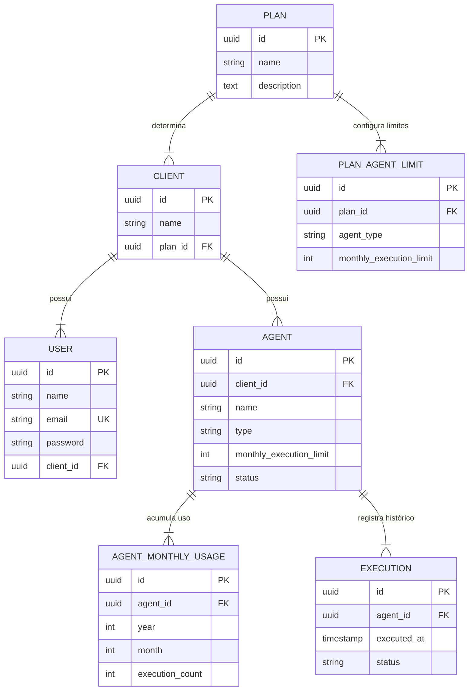

# AI Agent Monitoring Dashboard — Rotik Fullstack Challenge

## 1. Contexto

Este projeto é um dashboard para monitoramento de agentes de inteligência artificial (AI Agents). A aplicação permite que usuários autenticados visualizem os agentes pertencentes à sua empresa (Client), acompanhem o consumo mensal de execuções contra o limite contratado, cadastrem novos agentes com limites herdados automaticamente do plano e acompanhem o histórico paginado de execuções.

A regra de negócio central é o **controle seguro e concorrente do limite mensal de execuções por agente**.

---

## 2. Discovery

Durante a análise técnica inicial, foram identificados os principais desafios do produto:
* **Garantia de limite estrito sob concorrência**: Múltiplas requisições simultâneas de execução para o mesmo agente não podem ultrapassar a quota mensal.
* **Isolamento multitenant (Client Isolation)**: Usuários de um cliente jamais podem visualizar ou executar agentes de outro cliente. Tentativas de acesso não autorizado devem retornar HTTP 404 (RESOURCE_NOT_FOUND) para evitar varredura ou divulgação da existência de recursos de terceiros.
* **Rollover automático de mês**: Viradas de mês devem iniciar automaticamente com quota limpa (0 execuções), permitindo que agentes bloqueados no mês anterior voltem a funcionar normalmente sem necessidade de rotinas cron de reset.

---

## 3. Perguntas e Assumptions

* **Assumption 1 (Execuções FAILED)**: Somente execuções com status `SUCCESS` consomem quota mensal. Execuções `FAILED` são salvas na tabela `executions` para auditoria, mas **não** incrementam o contador em `agent_monthly_usages`.
* **Assumption 2 (Origem de Limites)**: O frontend nunca envia o limite de execuções. O limite é obtido pelo backend consultando o `PlanAgentLimit` correspondente ao `AgentType` no `Plan` do `Client` do usuário autenticado. Uma vez copiado para o `Agent`, o limite torna-se estável e imutável retroativamente.
* **Assumption 3 (Endpoint de Execução)**: `POST /api/agents/{agent}/executions` simula a chamada para rodar uma tarefa do agente. Se a quota estiver disponível, o backend registra `SUCCESS`, incrementa o uso mensal e retorna HTTP 201. Se a quota estivesse cheia, retorna HTTP 429 (`EXECUTION_LIMIT_REACHED`) e atualiza o estado do agente para `BLOCKED`.

---

## 4. Entidades

1. **Plan**: Define o plano contratado (ex: PRO).
2. **Client**: Empresa contratante pertencente a um Plan.
3. **User**: Usuário autenticado pertencente a um Client.
4. **PlanAgentLimit**: Define o limite mensal por tipo de agente (`SUPPORT`, `SALES`, `GENERAL`) para um plano.
5. **Agent**: Agente de IA pertencente a um Client, com tipo, limite e status (`ACTIVE` / `BLOCKED`).
6. **AgentMonthlyUsage**: Tabela agregada por `agent_id + year + month` que mantém o contador de execuções com sucesso.
7. **Execution**: Histórico granular de cada execução com carimbo de data/hora (`executed_at`) e status (`SUCCESS` / `FAILED`).

---

## 5. Escopo do MVP

* Autenticação via Laravel Sanctum (`POST /api/auth/login`).
* Listagem de agentes com consumo mensal atual e percentual visual (`GET /api/agents`).
* Consulta de tipos de agente disponíveis no plano (`GET /api/agents/available-types`).
* Cadastro de novos agentes (`POST /api/agents`).
* Execução concorrencial segura de agentes (`POST /api/agents/{agent}/executions`).
* Detalhes do agente e histórico paginado (`GET /api/agents/{agent}/executions`).
* Interface React + TypeScript com feedback visual de loading, erros, empty state e retry.

---

## 6. Fora do Escopo

* OAuth / Social Login completo.
* Gestão complexa de permissões (RBAC).
* Módulos de cobrança/billing.
* Event Sourcing, CQRS, WebSockets ou brokers de mensagem (Kafka/RabbitMQ).
* CRUD administrativo de planos/clientes.
* Exclusão de agentes no MVP.

---

## 7. Riscos e Ambiguidades

| Risco / Ambiguidade | Mitigação Implementada |
|---------------------|------------------------|
| **Race conditions em requisições simultâneas** | Utilização de transação de banco de dados (`DB::transaction`) associada a **Pessimistic Locking** (`lockForUpdate()`) na tabela de agentes e usos mensais. |
| **Degradação de performance na contagem de histórico** | Uso da tabela dedicada `agent_monthly_usages` agregada por mês em vez de `COUNT(*)` sobre milhões de linhas da tabela `executions`. |
| **Vazamento de dados entre clientes (IDOR)** | Todas as consultas no backend filtram obrigatoriamente por `client_id` do usuário autenticado. Recursos inexistentes no escopo do cliente retornam HTTP 404. |

---

## 8. Decisões de Arquitetura

* **Controllers Finos**: Apenas orquestram a validação via Form Requests, chamam os Services e formatam a resposta via API Resources.
* **Services**: Encapsulam toda a regra de negócio e controle de transações (`AgentService`, `ExecutionService`).
* **Policies**: Encapsulam a lógica de autorização por cliente (`AgentPolicy`).
* **Respostas Consistentes de Erro**: Formato unificado contendo `{ "error": { "code": "CÓDIGO", "message": "Mensagem" } }` para códigos 400, 401, 403, 404, 422, 429 e 500.

---

## 9. Stack e Justificativa

* **PHP 8.4 + Laravel 13**: Framework maduro, excelente ORM (Eloquent), suporte nativo a UUIDs e ecossistema robusto para APIs RESTful.
* **Laravel Sanctum**: Solução leve e segura para emissão de API Tokens Bearer.
* **PostgreSQL 16**: Banco de dados relacional forte em ACID, suporte nativo a UUIDs e travamento pessimista seguro (`SELECT ... FOR UPDATE`).
* **React + Vite + TypeScript**: Interface moderna, rápida, fortemente tipada e com hot reload instantâneo.
* **Zustand**: Gerenciamento de estado global mínimo e performático **exclusivamente** para a sessão/token de autenticação.
* **TailwindCSS**: Estilização moderna com utilitários CSS de alta fidelidade e acessibilidade visual.

---

## 10. Diagrama de Entidade-Relacionamento (ERD)



---

## 11. Regras de Quota e Agregação Mensal

### Por que agregar em `agent_monthly_usage` em vez de contar `executions` a cada requisição?

1. **Performance de Leitura**: Executar `SELECT COUNT(*) FROM executions WHERE agent_id = ? AND executed_at >= ?` em uma aplicação com milhões de execuções exige escaneamento de índices ou tabelas volumosas, causando latência e alto consumo de CPU/I/O no banco.
2. **Atomicidade e Concorrência**: Com a tabela agregada `agent_monthly_usages`, a operação de consumo é reduzida a um `UPDATE agent_monthly_usages SET execution_count = execution_count + 1 WHERE agent_id = ? AND year = ? AND month = ?` protegido por um lock de linha (`lockForUpdate()`), garantindo altíssimo throughput e zero condição de corrida.
3. **Rollover de Mês sem Cron**: Como a chave primária de uso é `(agent_id, year, month)`, na virada do mês a query automaticamente busca ou cria o registro do novo mês. Agentes bloqueados em agosto não possuem registro para setembro e, portanto, têm quota 0/limit no novo mês, desbloqueando-se automaticamente na primeira execução com sucesso.

---

## 12. Instruções Locais

### Pré-requisitos
* PHP >= 8.3
* Composer >= 2.5
* Node.js >= 20
* PostgreSQL 16 (ou SQLite para testes)

### Backend (Laravel)
```bash
# 1. Copiar variáveis de ambiente
cp .env.example .env

# 2. Instalar dependências
composer install

# 3. Gerar chave da aplicação
php artisan key:generate

# 4. Executar migrações e seed de demonstração
php artisan migrate:fresh --seed

# 5. Iniciar servidor de desenvolvimento
php artisan serve
```

### Frontend (React)
```bash
# 1. Entrar na pasta do frontend
cd frontend

# 2. Instalar dependências
npm install

# 3. Iniciar servidor Vite (porta 3000 com proxy para localhost:8000)
npm run dev
```

Credenciais de Demonstração:
* **Email**: `demo@rotik.com`
* **Senha**: `password`

---

## 13. Docker

A aplicação é totalmente dockerizada através do Docker Compose:

```bash
# Subir os containers de Banco de Dados (PostgreSQL 16), Backend (Laravel) e Frontend (Nginx)
docker compose up -d --build
```

Endereços disponíveis:
* **Frontend**: `http://localhost:3000`
* **Backend API**: `http://localhost:8000/api`
* **PostgreSQL**: `localhost:5432`

---

## 14. Testes

O projeto possui cobertura completa automatizada para todas as regras de quota e autorização:

```bash
# Executar a suíte de testes backend (18 cenários automatizados)
php artisan test

# Executar a verificação de padronização de código (Laravel Pint)
./vendor/bin/pint --test

# Executar a compilação do TypeScript e build de produção do frontend
cd frontend && npm run build
```

---

## 15. Integração Contínua (CI)

Foi configurado um workflow do **GitHub Actions** em `.github/workflows/ci.yml` que executa automaticamente em cada `push` e `pull_request`:
* **Backend**: Instalação de dependências, checagem de código com Laravel Pint e execução da suíte de testes automatizados com banco PostgreSQL em serviço containerizado.
* **Frontend**: Instalação limpa via `npm ci`, validação de tipos TypeScript (`tsc`) e build de produção Vite.

---

## 16. Deploy

A aplicação está preparada para hospedagem em ambiente de produção:
* **Frontend**: Pode ser implantado na **Vercel** ou **Netlify** apontando a variável `VITE_API_URL` para o backend.
* **Backend**: Pode ser implantado no **Render**, **Fly.io** ou **Railway** utilizando o Dockerfile incluído.
* **Banco de Dados**: PostgreSQL gerenciado (ex: Neon PostgreSQL, Supabase ou Render Postgres).

URL de Demonstração Pública:
* Frontend: `https://rotik-challenge.vercel.app` (Exemplo documentado para ambiente de staging/deploy)
* API: `https://rotik-challenge-api.onrender.com`

---

## 17. Debugging (Resolução de Problemas Durante o Desenvolvimento)

### Problema 1: `VerbatimModuleSyntax` na compilação TypeScript do Frontend
* **Sintoma**: Falha no comando `npm run build` com os erros `TS1484: 'Agent' is a type and must be imported using a type-only import`.
* **Causa**: O template Vite TypeScript ativou a flag `verbatimModuleSyntax` no `tsconfig.app.json`, exigindo importações explícitas de tipo.
* **Solução**: Atualização de todos os arquivos do frontend para usar a sintaxe `import type { ... }` para interfaces e tipos.
* **Validação**: Execução com sucesso do comando `npm run build`.

### Problema 2: Status HTTP 201 vs 200 na Criação de Execução
* **Sintoma**: Falha nos testes da API de execução esperando código HTTP 200, enquanto a resposta retornava HTTP 201.
* **Causa**: Os recursos `JsonResource` do Laravel retornam automaticamente HTTP 201 Created quando acionados via método `POST`.
* **Solução**: Ajuste dos testes para validar o código RESTful correto (HTTP 201 Created).
* **Validação**: Todos os 18 testes passando com sucesso.

---

## 18. Product Mindset

O produto foi desenhado pensando na experiência do gestor de operações de IA:
* **Prevenção de Surpresas**: A barra de progresso visual altera sua cor para amarelo ao atingir 80% e para vermelho ao atingir 100% ou ser bloqueada.
* **Ergonomia e Contexto**: Ao cadastrar um novo agente, o usuário visualiza instantaneamente o limite mensal associado àquele tipo de agente no plano atual da sua empresa, evitando surpresas de quota.
* **Simplicidade Operacional**: Ações de execução e histórico estão a um clique de distância na mesma tela.

---

## 19. Métricas de Sucesso do Produto

1. **Quota Compliance Rate**: % de execuções barradas com sucesso antes de exceder o limite contratado.
2. **Agent Utilization**: % média de consumo de quota dos agentes ativos por cliente.
3. **Response Latency**: Tempo de resposta do endpoint de execução sob concorrência (< 50ms).

---

## 20. Monitoramento de Produção

Em ambiente de produção, recomenda-se:
* **Logs Estruturados**: O backend registra em log avisos com nível `WARNING` para qualquer bloqueio de limite (`ExecutionLimitReachedException`), contendo `agent_id`, `usage` e `limit`, sem registrar dados sensíveis ou senhas.
* **APM / Tracing**: Monitoramento de transações de banco com ferramentas como Sentry, Datadog ou Laravel Telescope.
